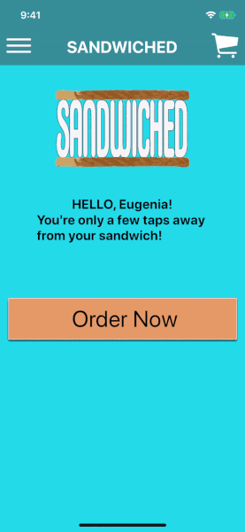

# Sandwiched 

A sandwich ordering app for iOS that enables a user to choose from a menu of sandwich options. 

## Instructions 

1. npm install

2. npm start 

3. scan QR code generated on your iOS device. 

(Make sure you are running in conjunction with the backend which can be found here: <a href="https://github.com/TheEugeniaKim/sandwiched_api_backend" > Back-end Repo </a>)

## Demo 

